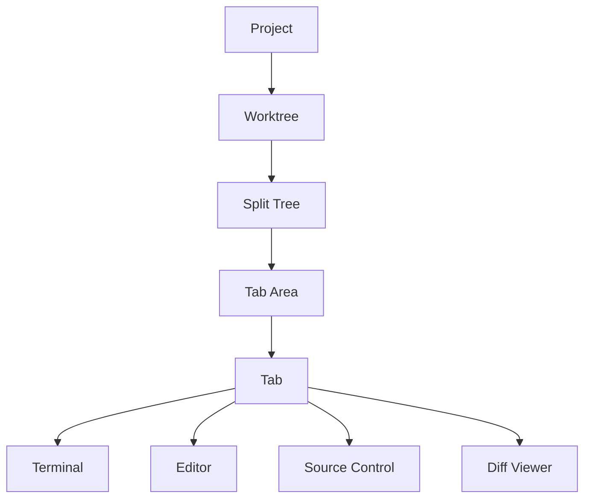

# Muxy Documentation

Muxy is a native macOS terminal multiplexer organized around projects, worktrees, tabs, and split panes. It also ships a built-in editor, source-control UI, file tree, and a WebSocket API for companion apps.

## User Guide

| Page | What's in it |
| --- | --- |
| [Getting Started](user-guide/getting-started.md) | Install, add a project, first tabs |
| [Keyboard Shortcuts](user-guide/keyboard-shortcuts.md) | Default bindings, all remappable |
| [Settings](user-guide/settings.md) | Every preference tab explained |
| [Troubleshooting](user-guide/troubleshooting.md) | Logs, common fixes, reset state |

## Features

| Page | What's in it |
| --- | --- |
| [Projects](features/projects.md) | Add/switch projects, IDE launch, CLI, URL scheme |
| [Worktrees](features/worktrees.md) | Per-worktree workspaces, setup commands |
| [Tabs & Splits](features/tabs-and-splits.md) | Tab kinds, splits, drag & drop, pinning |
| [Terminal](features/terminal.md) | Ghostty config, find, copy/paste, custom commands |
| [Editor](features/editor.md) | Built-in editor, quick open, markdown preview |
| [Source Control](features/source-control.md) | Git status, diff, branches, pull requests |
| [File Tree](features/file-tree.md) | Gitignore-aware tree, file ops, drag & drop |
| [Layouts](features/layouts/README.md) | Declarative `.muxy/layouts/*.yaml` workspaces |
| [Notifications](features/notifications.md) | OSC sequences, hooks, socket API |
| [AI Usage](features/ai-usage.md) | Claude Code, Copilot, Codex, Cursor, and more |
| [Themes](features/themes.md) | Theme picker and Ghostty config |
| [Remote Server](features/remote-server/README.md) | WebSocket API for mobile clients |

## Developer

| Page | What's in it |
| --- | --- |
| [Architecture](developer/architecture/README.md) | System overview, components, data flow |
| [Building Ghostty](developer/building-ghostty.md) | Building the GhosttyKit xcframework |
