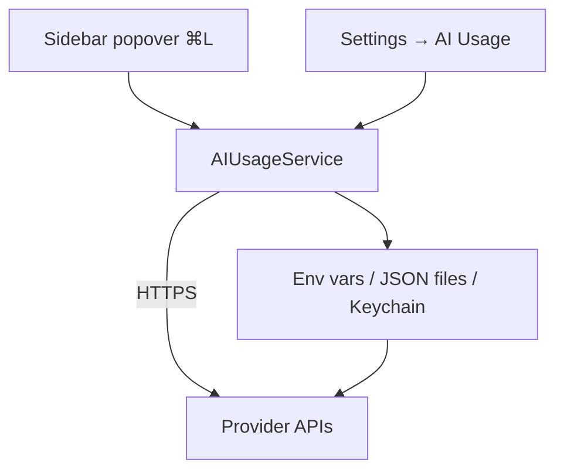

# AI Usage

Muxy reads usage / quota data from common AI coding providers and surfaces it in a sidebar popover. Toggle the popover with `⌘L` or **View → AI Usage**.

Tracking is **read-only** — Muxy reads tokens you've already configured for each tool and queries each vendor directly. Nothing is sent to Muxy's servers.

## Supported providers

Claude Code · GitHub Copilot · OpenAI Codex CLI · Cursor CLI · Amp · Z.ai · MiniMax · Kimi · Factory.

Enable / disable each in **Settings → AI Usage**.

## What's shown

Per provider, you see what that provider exposes — typically some combination of:

- Session / 5h / hourly windows
- Premium request count
- Daily / weekly / monthly limits
- Billing period summary

Toggle **Show Secondary Limits** in settings to keep the popover compact.

## Where the data comes from

| Source | Used for |
| --- | --- |
| Environment variables | e.g. `CLAUDE_CODE_OAUTH_TOKEN`, `ZAI_API_KEY` |
| Vendor JSON credential files | `~/.claude`, `~/.cursor`, `~/.codex`, … (overridable via `CLAUDE_CONFIG_DIR`, `CODEX_HOME`, …) |
| macOS Keychain | via `/usr/bin/security find-generic-password` |

For providers that need OAuth refresh (Claude Code, Factory, Kimi), Muxy refreshes tokens silently before fetching usage.

## Auto-refresh

Choose an interval in **Settings → AI Usage**: Off / 5m / 15m / 30m / 1h. Manual refresh is always available from the popover.

## Hook integrations

For Claude Code, OpenCode, Codex, and Cursor, Muxy can also receive real-time usage and notification events through hook scripts that ship with the app. See [Notifications](notifications.md) for the shared hook setup.
