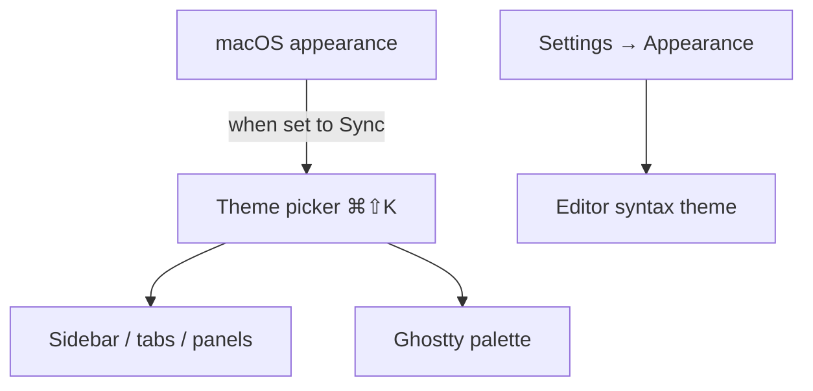

# Themes

Muxy uses a paired light / dark theme model. The chrome (sidebar, tabs, panels) and the terminal share the same color palette so everything stays visually consistent.

## Theme picker

Open with `⌘⇧K` (or click the theme button in the topbar). You can pick:

- A **Light** variant
- A **Dark** variant
- **Sync to system** (default) — switches automatically with macOS appearance.

Selection is saved per-appearance, so your dark choice and light choice are remembered independently.

## Syntax highlighting

The editor's syntax theme is chosen separately in **Settings → Appearance**. Several built-in syntax themes are available; pick whichever pairs well with your chrome theme.

## Ghostty colors

Terminal colors come from the Ghostty config (`~/.config/ghostty/config`). When you change theme in Muxy, the matching light/dark variant of your Ghostty colors is applied automatically. To customise the palette directly, edit Ghostty's config — see [Ghostty's theme docs](https://ghostty.org/docs/config/reference#theme).

## Reload

After editing Ghostty config, **Muxy → Reload Configuration** (`⌘⇧R`) re-reads it without restarting.
