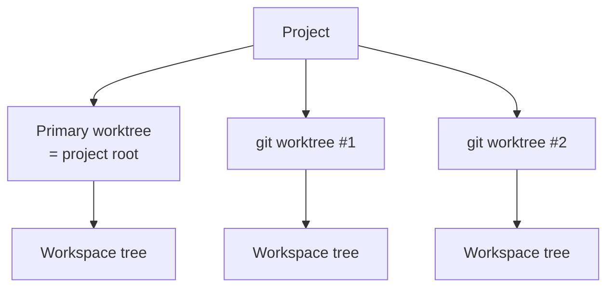

# Worktrees

Every project starts with a primary worktree (the project root). Git projects can attach more — each worktree has its own tabs, splits, and active selection.

## Worktree picker

Click the worktree button in the topbar (or `⌘⇧O`) to:

- See all known worktrees and their branches.
- Create a new git worktree.
- Refresh the list (picks up worktrees created externally with `git worktree add`).

## Creating a worktree

The **New Worktree** sheet asks for:

| Field | Notes |
| --- | --- |
| Branch | Existing branch, or a new branch name |
| Base | Ref to branch from (when creating a new branch) |
| Path | Where the worktree directory should live |

Muxy runs `git worktree add` and registers the new worktree with the project.

## Setup commands

If `.muxy/worktree.json` exists, its setup commands run automatically when a tab is created in a freshly added worktree. Use it to bootstrap dependencies (`npm install`, `bundle install`, …) for ephemeral worktrees.

## Persistence

Per-project worktree records live at `~/Library/Application Support/Muxy/worktrees/<projectID>.json`. Removing a project also removes its worktree records. Externally discovered worktrees are never touched by Muxy's cleanup paths — only the user's repo can unregister them.

## Notes

- Switching worktrees does **not** kill running terminals — they stay alive; you just see a different worktree's tabs.
- The primary worktree (project root) is always present and cannot be deleted from Muxy.
